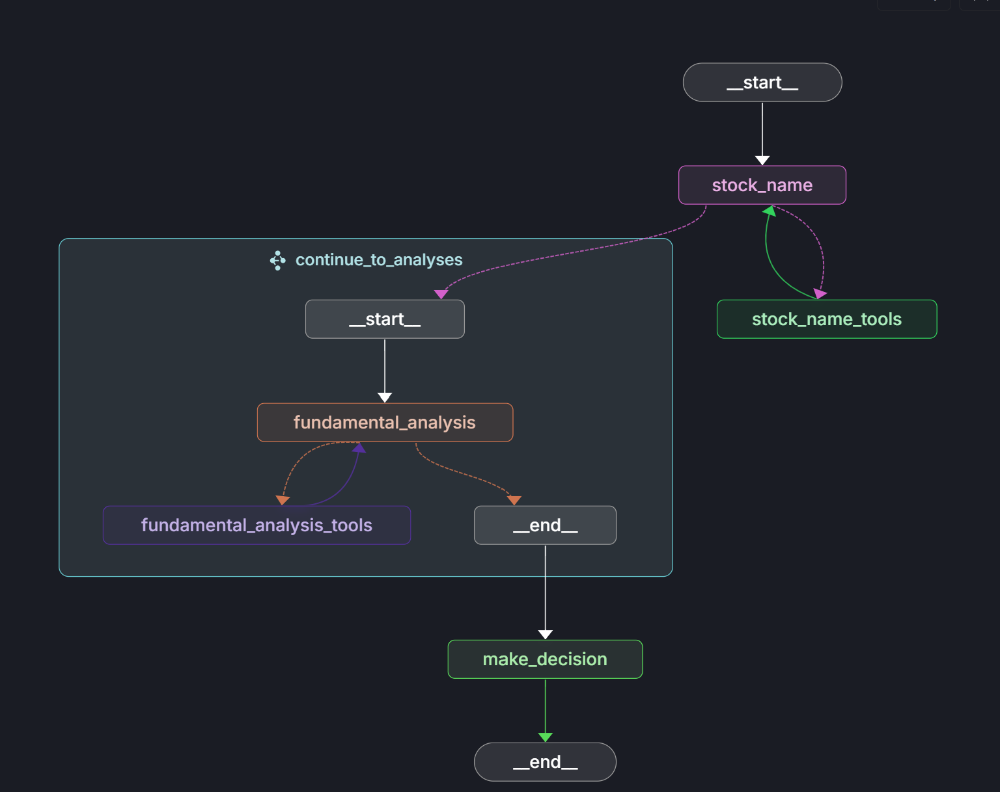

# Stock Assistant Agent

An intelligent stock analysis agent built using [LangGraph](https://github.com/langchain-ai/langgraph) that provides comprehensive stock analysis by combining fundamental and technical analysis to make investment decisions.

<div align="center">
  
</div>

The stock assistant agent performs multi-step analysis including:
- **Stock Identification**: Automatically identifies and formats stock tickers for NSE (National Stock Exchange)
- **Fundamental Analysis**: Analyzes financial ratios, earnings reports, and company fundamentals
- **Technical Analysis**: Evaluates charts, trends, and technical indicators
- **Investment Decision**: Makes buy/sell/hold recommendations based on combined analysis

The core logic is defined in `src/agent/agent.py`, which orchestrates a sophisticated workflow using Azure OpenAI models and external research tools.

## Features

- **Multi-Modal Analysis**: Combines fundamental and technical analysis for comprehensive stock evaluation
- **Parallel Processing**: Performs fundamental and technical analysis simultaneously for efficiency
- **AI-Powered Research**: Uses Perplexity AI for real-time market research and analysis
- **Advanced Reasoning**: Employs Azure OpenAI's reasoning models for investment decision making
- **NSE Integration**: Specifically optimized for Indian National Stock Exchange (NSE) stocks

## Architecture

The agent consists of three main subgraphs:

1. **Stock Name Resolution**: Identifies and validates stock ticker symbols
2. **Fundamental Analysis**: Analyzes company financials, earnings, and fundamentals
3. **Technical Analysis**: Evaluates price trends, charts, and technical indicators
4. **Decision Engine**: Combines both analyses to make investment recommendations

## Prerequisites

- Python 3.9+
- Azure OpenAI API access with GPT-4.1 and O3 models
- Perplexity API key for research capabilities

## Getting Started

1. Clone the repository and install dependencies:

```bash
cd Stock-Assistant
pip install -e . "langgraph-cli[inmem]"
```

1. Set up environment variables by creating a `.env` file:

```bash
cp .env.example .env
```

Configure the following required environment variables in your `.env` file:

```env
# Azure OpenAI Configuration
AZURE_OPENAI_DEPLOYMENT_NAME=your-gpt4-deployment-name
AZURE_OPENAI_REASONING_DEPLOYMENT_NAME=your-o3-deployment-name
AZURE_OPENAI_API_KEY=your-azure-openai-api-key
AZURE_OPENAI_ENDPOINT=your-azure-openai-endpoint

# Perplexity API for research
PERPLEXITY_API_KEY=your-perplexity-api-key

# Optional: LangSmith for tracing
LANGSMITH_API_KEY=lsv2...
```

1. Start the LangGraph Server:

```shell
langgraph dev
```

## Usage

Once the server is running, you can interact with the stock assistant by providing a stock name or company. The agent will:

1. Identify the correct stock ticker symbol for NSE
2. Perform fundamental analysis using financial data and research
3. Conduct technical analysis of price movements and indicators
4. Provide a final buy/sell/hold recommendation with reasoning

### Example Analysis

**Query**: "Analyze Vodafone Idea for investment"

**Agent Response**:

```
Investment call on Vodafone Idea Ltd. (NSE: IDEA): SELL / AVOID

Why a SELL (or "Avoid Fresh Exposure") is the more prudent stance

1. Fundamentals remain severely impaired  
   • Persistent, very large net losses (TTM loss ₹273 bn; net-profit margin –63 %).  
   • Negative equity (Debt/Equity –279 %); high interest cost with coverage <1×.  
   • No visible path to sustained profitability or positive free cash flow in the near term.  
   • Ongoing dilution risk: the company will likely have to issue more equity to service spectrum dues and cap-ex requirements for 4G/5G.  
   • Parent-company support has diminished (Vodafone Group stake down to 16 %).

2. Technical picture is outright bearish  
   • Price (₹6.9) sits below every key moving average (20/50/100/200-DMA).  
   • RSI <40, CCI < –100, Stoch-RSI at zero → momentum strongly negative.  
   • "Strong-Sell" readings across most trading platforms; no reversal patterns evident.  
   • Volume profile suggests distribution, not accumulation.

3. Risk-reward is unattractive  
   • Upside depends on a multi-year turnaround that will require heavy capital, favourable regulator decisions and market-share gains against healthier peers (Jio, Bharti Airtel).  
   • Downside catalysts are plentiful: further equity dilution, higher funding costs, possible AGR-payment slippages, and continual subscriber erosion.

4. No dividend or defensive income stream to compensate for risk.

Who might still consider holding?  
• Very short-term traders who thrive on high beta/penny-stock moves and can cut losses quickly.  
• Long-horizon speculators betting on a government or strategic-partner rescue. If you fall in this camp, position sizing and a hard stop-loss below ₹6.7 are essential.

Bottom-line view  
Both the balance-sheet reality and the price chart point the same way: capital is better deployed elsewhere in the Indian telecom space (e.g., Bharti Airtel) or in entirely different sectors until Vodafone Idea's leverage, cash-flow and trend profile improve markedly.

—This opinion is provided for informational purposes only and is not personalised investment advice. Always consult a licensed financial professional and consider your own risk tolerance before acting.
```

## Model Configuration

The agent uses two Azure OpenAI models:

- **GPT-4**: For stock identification, fundamental analysis, and technical analysis
- **O3 (Reasoning)**: For making the final investment decision based on combined analysis

## Customization

### Adding New Analysis Types

You can extend the agent by adding new analysis subgraphs in `src/agent/agent.py`:

1. Define a new state class (similar to `FundamentalAnalysisState`)
2. Create analysis functions with appropriate system prompts
3. Build a subgraph with tool integration
4. Integrate into the main workflow

### Modifying System Prompts

The analysis behavior can be customized by modifying the system prompts:

- `FUNDAMENTAL_ANALYSIS_SYSTEM_PROMPT`: Controls fundamental analysis approach
- `TECHNICAL_ANALYSIS_SYSTEM_PROMPT`: Controls technical analysis methodology
- `STOCK_NAME_SYSTEM_PROMPT`: Controls stock identification logic
- `DECISION_SYSTEM_PROMPT`: Controls investment decision reasoning

### Supported Exchanges

Currently optimized for NSE (National Stock Exchange) stocks. To add support for other exchanges, modify the `STOCK_NAME_SYSTEM_PROMPT` and update the ticker format requirements.

## Development

The application supports hot reload for development. Changes to the graph logic will be automatically applied when using `langgraph dev`.

Key files:
- `src/agent/agent.py`: Main agent logic and graph definition
- `langgraph.json`: LangGraph configuration
- `requirements.txt`: Python dependencies

## Testing

Run the test suite:

```bash
# Unit tests
pytest tests/unit_tests/

# Integration tests
pytest tests/integration_tests/
```

## Contributing

1. Fork the repository
2. Create a feature branch
3. Make your changes
4. Add tests for new functionality
5. Submit a pull request

## License

This project is licensed under the MIT License - see the [LICENSE](LICENSE) file for details.

## Acknowledgments

- Built with [LangGraph](https://github.com/langchain-ai/langgraph) for workflow orchestration
- Uses [Azure OpenAI](https://azure.microsoft.com/en-us/products/ai-services/openai-service) for AI capabilities
- Powered by [Perplexity AI](https://www.perplexity.ai/) for real-time research
- Supports analysis of [NSE](https://www.nseindia.com/) listed stocks

## Disclaimer

This tool is for educational and research purposes only. Investment decisions should not be made solely based on AI recommendations. Always consult with qualified financial advisors and conduct your own research before making investment decisions.
